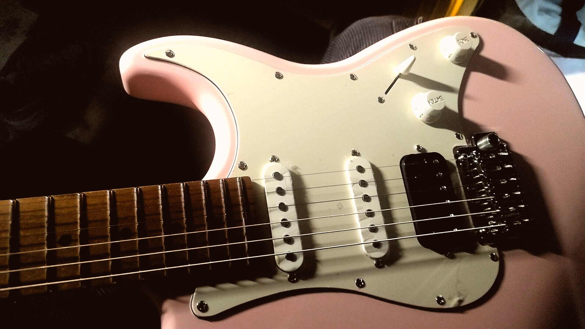
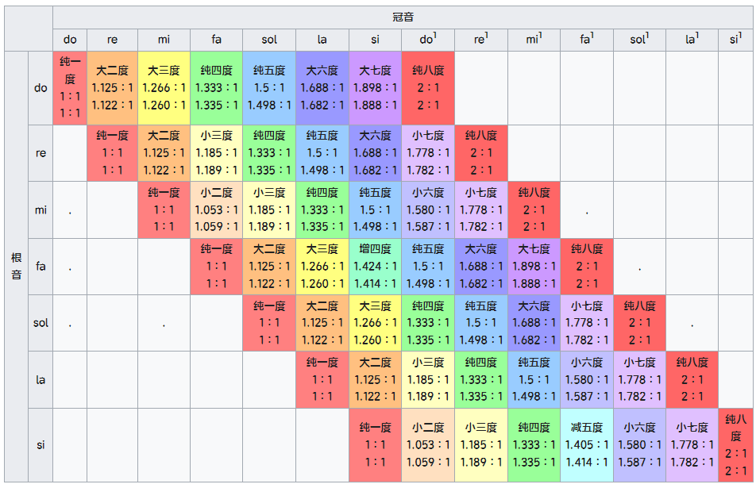
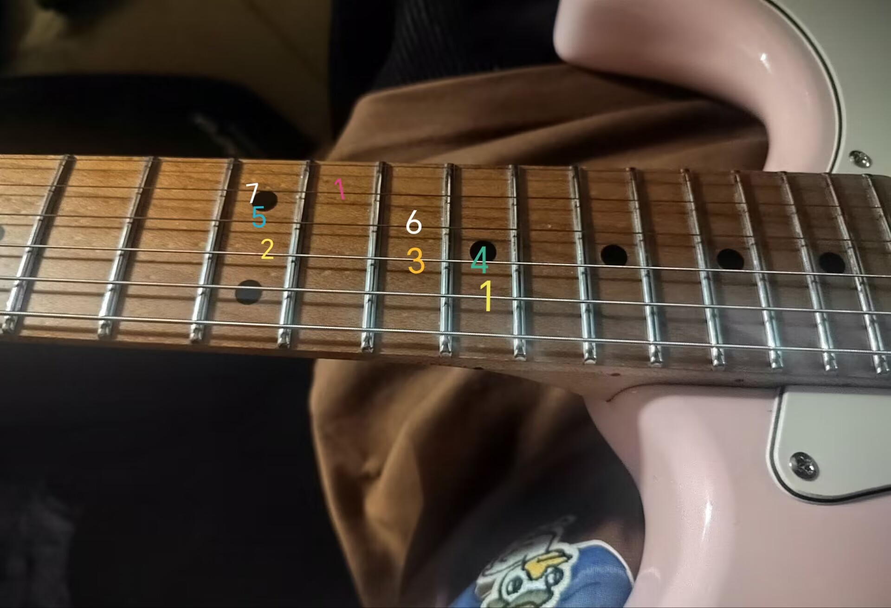
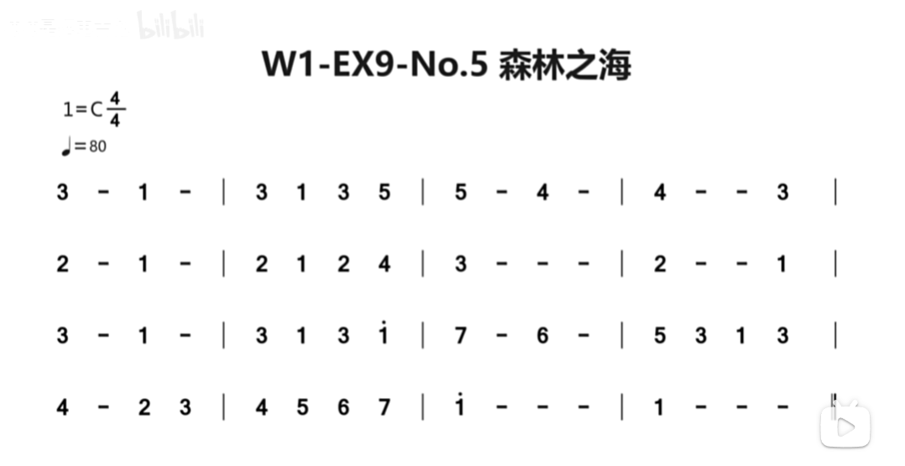

## 开始学电吉他了！ 

购买的琴型是[keipro ks150M](https://www.instagram.com/soundscape_nepal/reel/C_YHFfKSCRy/?locale=zh-hans) 上手手感很棒 颜值也很高

<!--  -->

### 基础乐理

- 音程

音程指的是一个乐音体系中，两个音之间的高低关系。两个音可以有前后顺序，也可以同时发声。较低的音称为**根音**或下方音，较高的音称为**冠音**或上方音。

<!--  -->

不同的音程往往能够带来不同的声响特质与情感、不同的音程除了在**和谐程度与稳定性**上有所差异外，各有其自身独特的音乐语言意涵，能带给听者不同的感受，进一步触发听者作更多联想，提升演奏诠释与音乐创作的灵活与深刻。

音程之谐和程度与泛音列相关，一音程内两音的泛音列月相似，则越谐和，且稳定性越高，动能越低。音程依和谐程度之不同，分成三类

- 第一类：

完全和谐音程，包括：完全同度、完全四度、完全五度与完全八度，能带给听者稳定之感：完全同度之稳定性排名第一；完全八度之稳定性排名第二；完全五度稳定性排名第三；完全四度稳定性仅稍微完全五度，不过自十三世纪起开始排名逐渐将至第九名。

- 第二类：

不完全和谐音程，包括：大三度、小三度、大六度与小六度，也能带给听者一定程度之稳定感，但在心理上给听者一种仿佛话还没说尽的感觉：大三度与小三度稳定性皆排名第五，大三度带来较光亮与开朗之感，小三度则较悲伤忧郁；大六度与小六度稳定性皆排名第六，大六度听来较光亮，小六度则较忧伤。

- 第三类：

完全不和谐音程，包括：大二度、小二度、大七度、小七度、所有增音程与所有减音程，带给听者不稳定的感觉，因而含有「动能」和「引力」：大七度的稳定性排名第七，小七度稳定性排名第八，其中，大七度比小七度更亮一些；大二度之稳定性有排名第九，小二度则有排名第十，小二度听来比大二度更尖锐；增、减音程之组成较多样化，故此处先以增四度与减五度为例说明，排名第十一：增四度与减五度给听者焦虑与黯淡之感，且急须解决至相对稳定的音程上，通常，增四度解决至六度，而减五度解决至三度。

### 练习日志

【2024.10.13】今天苦练2h+食指中指无名指爬格子、死记硬背记住了电吉他音高的位置

<!--  -->

【2024.10.14】今天也是努力爬格子+节奏乐理学习+简谱小星星练习

    简单录了一段（节奏好不熟练( ´◔ ‸◔`) 



【2024.10.15】吉他一天都在练习吉他！除了基本的爬格子之外，今天开始训练节奏，跟着节拍器狠狠训练`小星星`*100、此外还学习了新曲目`森林之海`！

<!--  -->

</img>

【2024.10.16】今天复习了前几天的联系，主要是三指爬格子和森林海的温习。

[参考来源](https://yidechen.com/2020/06/26/%E9%9F%B3%E7%A8%8B%E7%9A%84%E8%AA%9E%E8%A8%80%E6%84%8F%E7%BE%A9%E8%88%87%E5%88%9D%E6%AD%A5%E6%87%89%E7%94%A8/)

